# Crypto Exchange Rate Monitoring and Mailing System

## Overview

This serverless application monitors cryptocurrency-to-fiat exchange rates in real-time and sends email alerts when significant price changes occur. Built on AWS serverless technologies, it provides a cost-effective and scalable solution for tracking cryptocurrency markets.

## Architecture Diagram

```mermaid
graph TD
  A[CloudWatch Events<br><small>5-minute Schedule</small>] -->|Triggers| B[AWS Lambda<br><small>Python 3.9</small>]
  B -->|API Call| C{{Alpha Vantage API}}
  B -->|Read/Write| D[(Amazon DynamoDB<br><small>Exchange Rates</small>)]
  B -->|Publish| E[[Amazon SNS]]
  E -->|Send| F[📧 Email]
  B -->|Logs| H((CloudWatch<br>Logs))
  
  style A fill:#FFA07A,stroke:#333
  style B fill:#6505ED,stroke:#333
  style D fill:#765FB98,stroke:#333
  style E fill:#FFD870,stroke:#333
```

## Key Relationships:

- CloudWatch Events → Lambda: Time-based invocation
- Lambda ↔ DynamoDB: Bi-directional data flow
- Lambda → SNS: Conditional alert publishing
- All services → CloudWatch: Unified observability

**This architecture ensures:**

- Decoupling: Services interact via APIs/events
- Resilience: Automatic retries for failures
- Scalability: Handles spikes in crypto market volatility

## AWS Services Breakdown

### 1. **AWS Lambda (Data Processing Phase)**
**Role**: The core processing engine  
**Function**:
- Executes every 5 minutes (configurable)
- Fetches real-time exchange rates from Alpha Vantage API
- Calculates percentage changes from previous rates
- Determines when to trigger alerts
- Manages data storage in DynamoDB

**Configuration**:
- Python 3.9 runtime
- 256MB memory
- 60-second timeout
- Environment variables for configuration

### 2. **Amazon DynamoDB (State Management Phase)**
**Role**: Persistent storage for exchange rate history  
**Structure**:
- Table: `{prefix}-exchange-rates`
- Composite primary key:
  - Partition Key: `from_currency` (crypto symbol)
  - Sort Key: `to_currency` (fiat symbol)
- Attributes:
  - `rate` (current exchange rate)
  - `previous_rate`
  - `percent_change`
  - `timestamp`

**Features**:
- Pay-per-request billing
- Automatically scales with usage
- Stores historical data for change calculation

### 3. **Amazon SNS (Simple Notification Service)**
**Role**: Alert distribution system  
**Components**:
- Topic: `{prefix}-price-alerts`
- Email subscriptions
- Message formatting:
  - Current and previous rates
  - Percentage change
  - Timestamp

**Flow**:
1. Lambda publishes to SNS topic when thresholds are exceeded
2. SNS delivers formatted messages to all subscribers

### 4. **CloudWatch Events (Trigger Phase)**
**Role**: Scheduling trigger  
**Configuration**:
- Rule: `{prefix}-schedule`
- Schedule expression: `rate(5 minutes)`
- Target: Lambda function

**Features**:
- Guaranteed execution schedule
- Retry logic for failures
- Integration with CloudWatch Logs

## Data Flow

1. **Scheduling**  
   CloudWatch Events triggers the Lambda function on a fixed schedule (default: every 5 minutes).

2. **Data Fetching**  
   Lambda calls Alpha Vantage's `CURRENCY_EXCHANGE_RATE` endpoint for each configured cryptocurrency pair.

3. **Change Calculation**  
   For each currency pair:
   - Retrieves previous rate from DynamoDB
   - Calculates percentage change
   - Stores new rate in DynamoDB

4. **Alert Evaluation**  
   If any rate change exceeds the configured threshold:
   - Formats alert message with change details
   - Publishes to SNS topic

5. **Notification Delivery**  
   SNS delivers the alert to all subscribed email addresses.

## Configuration Options

| Environment Variable | Description | Default |
|----------------------|-------------|---------|
| `CRYPTO_SYMBOLS` | Crypto currencies to monitor | BTC,ETH,USDT,... |
| `FIAT_CURRENCY` | Base fiat currency | USD |
| `PRICE_CHANGE_THRESHOLD` | Percentage change to trigger alert | 1.0 |
| `ALPHA_VANTAGE_API_KEY` | API key for Alpha Vantage | - |
| `DYNAMODB_TABLE` | Table name for rate storage | {prefix}-exchange-rates |

## Monitoring

Key CloudWatch metrics to monitor:
- Lambda invocations/errors
- DynamoDB read/write capacity
- SNS message delivery success rate

## Troubleshooting

1. **No Alerts Received**
   - Check SNS subscription is confirmed
   - Verify Lambda execution logs
   - Ensure threshold is being exceeded

2. **API Errors**
   - Check Alpha Vantage API limits
   - Verify API key is valid

3. **Database Issues**
   - Confirm IAM permissions
   - Check table exists in DynamoDB

